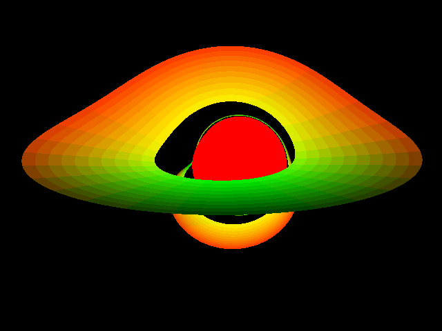

Black hole renderer
===================

Lite version
------------

A smaller single-file code for rendering a black hole with a disk is available in ``src/lite.cpp``.
The code supports only the Kerr metric (rotating black hole) and dummy disk coloring.

Use the following commands to compile and run it:

.. code-block:: bash

    mkdir -p build
    cd build
    cmake ..
    make lite
    ./lite

The given code produces the following image (stored as ``build/output_lite.tga``).

